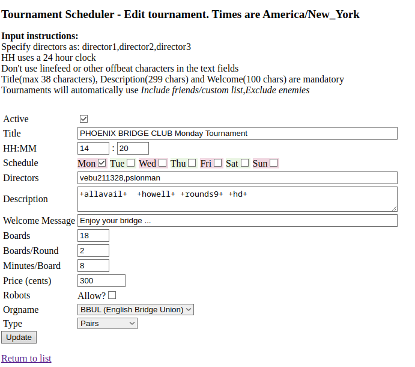
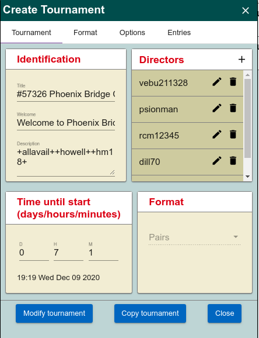
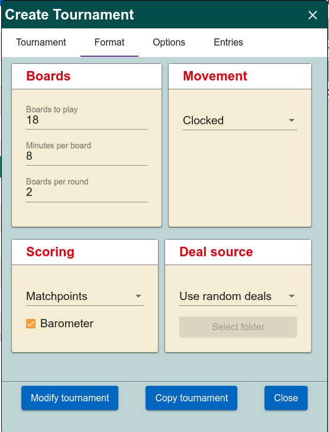
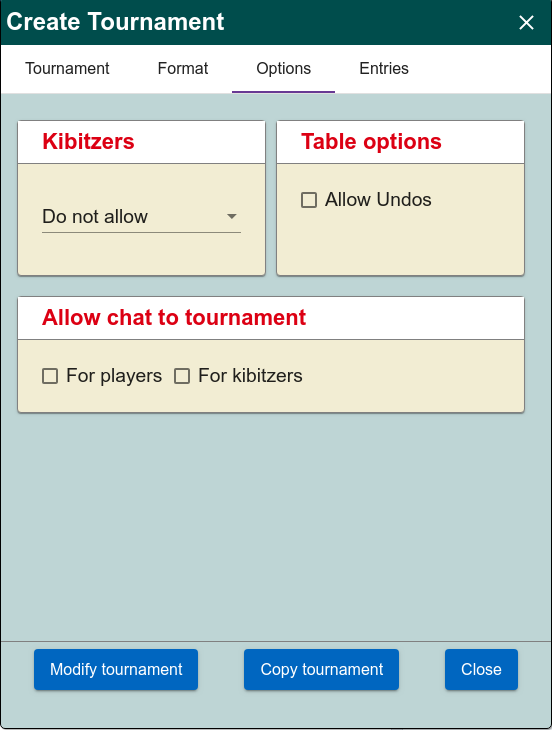
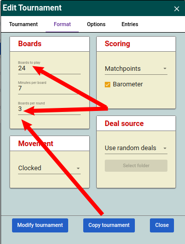
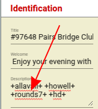
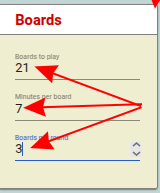

# Creating a tournament

## Using BBO's Tournament scheduler

BBO has a tool which allows you to automatically create tournaments froma scheduler ( see the [documentation here](https://blog.bridgebase.com/about-the-virtual-club-tournament-scheduler/?lid=w1pcd63w06so))

1. Log into the scheduler at [https://webutil.bridgebase.com/v2/vacbl/vacbl_login.php](https://webutil.bridgebase.com/v2/vacbl/vacbl_login.php)


    

    Make sure you have *Host Name* selected, then add the club's username and password.

    You will see the menu ...


    


2. To create a schedule click on *Tournament Scheduler* and you will see the Tournament Scheduler

    

    Note that the times are based on New York time and New York is usually 5 hours behind UK time. Our tournaments start at 14:20 New York time (use the 24 hour clock).

    NB check that the times are correct when we switch to and from British Summer Time.

    Tournaments are automatically created on the day that they are scheduled.

3. Once created, the tournaments can be modified as we currently do.

4. The schedule can also be modified should it be necessary.

## Using first principles

This document is based on the EBU document [Virtual Club Manager](https://blog.bridgebase.com/2020/04/02/the-virtual-club-manager-manual/). This has screen shots, but does not necessarily cover Phoenix's policies. For a fuller description see [Guide for Creating and Managing
a Tournament on BBO](https://doc.bridgebase.com/Help/Guide_for_BBO_TDs.pdf).

1. Log into BBO using the club's on-line director's login name and password.

1. Click on the *Director* tab.

1. Click on the *Create Tournament* button.

    In the *Create Tournament* panel there are four tabs:

    1. the *Tournament* tab:

        

        1. Give the Tournament a title (this is seen by members searching for the tournament when they wish to register), e.g.
            ```text
            Phoenix Bridge Club 8 June 2020
            ```
        1. Create or amend a Welcome Message if appropriate. (This is seen by members as the tournament launches.)

        1. The *Description* field is used to ensure that the tournament does not start until all registered players are on-line, and to define the movement.

            The code to handle registered player is *+allavail+*.

            We will use a Howell movement for eight tables or fewer and a Mitchell for nine tables or more. Here, we will set up the default as a Howell: *+howell+ +rounds9+*. (We currently expect eight or nine tables for our tournaments.)

            If nine or more tables register for an event the director need only remove the  text *+howell+ +rounds9+* from the description.

            For the avoidance of doubt:
            1. for 8 or fewer tables use: *+allavail+ +howell+ +rounds9+*
            2. for 9 or more tables use: *+allavail+*

            See the [table at the end of this section](#description_table).

            For more details see [BBO Description settings for tournaments](https://news.bridgebase.com/2020/11/17/description-settings-for-tournaments/)

            Avoid *+howell+ +hm18+* as this give revenge rounds for seven or eight tables (see [this BBO document](https://blog.bridgebase.com/2020/04/18/how-to-run-howell-for-small-tourneys/).)

        2. Enter the hours, days and minutes until the tournament will start.

            The actual start time will be generated and shown for you to check. (The tournament remains hidden in the BBO events screen until two hours before the start time.)

        3. Enter the BBO username of any other director associated with the event (if any). Please ensure that the *Club's* director (vebu211328) is at the top of the list as all director's calls go to the director at the top.

        4. The format should say *Pairs*

    2. the *Format* tab:

        

        1. Enter the number of hands to be played (18 or 24 for example). We use 18.

        2. The minutes to be allowed per board (6, 7 or 8 for example). We use 8. If a table has not completed a board they will be moved on at the expiry of the time at the table and BBO will attempt to allocate a score. If all of the tables have finished early, they will be moved on.

        3. The number of boards per round (2 or 3 for example)

        4. Scoring should be *Matchpoints*

        5. *Barometer* should be checked to allow players to see their scores during the game.

        6. Movement should be *Clocked*

        7. Deal Source: *Use random deals*

    3. the *Options* tab:

        

        1. Kibitzers: *Do not allow*

        2. Allow chat to tournament: uncheck both *For players* and *For kibitzers*

        3. Table options: uncheck *Allow Undos* and *Allow Video*


    4. the *Entries* tab:

        

        1. *Maximum entries*. This is the maximum number of *pairs* that will be allowed to register. (Generally we have no limit. The default is 40 which should be adequate.)

        2. Uncheck *Allow robots*. This means that players will not be able to elect to play with a robot as a partner. (NB do not create the tournament with this checked - you cannot remove it later and you will need to recreate the tournament from scratch.)

        3. In *Type* enter *BBUL*

        4. Set the *Entry fee* to 300 (Note this is in cents not dollars)

        5. Uncheck *Stars plays free*

        6. In *Restrictions* check:

            1. Include players followed by host

            2. Include custom list.

2. Finally, click on *Create Tournament*.


<span id="description_table">

| Tables | Description | Boards | Boards/round | Works for |
| --- | --- | --- | --- | --- |
| 3 | +allavail+ +howell+ +hm18+ | 20 | 4 | 3 tables |
| 4 | +allavail+ +howell+ +hm18+ | 18 | 3 | 4 tables |
| 5-8 | +allavail+ +howell+ +rounds9+ | 18 | 2 | 5-8 tables |
| 9+ | +allavail+ | 18 | 2 | 9+ tables |

**NB** Most things can be modified up to the point that the tournament starts, except *Allow robots* in the *Entries* section.

## Copying a tournaments

As we are holding weekly tournaments, and the general format will not change, it makes sense to use the *Copy Tournament* function to create next week's tournament.

To create next week's tournament, click on the *Directors* tab, select *Pending Tournaments*, and click on this week's tournament. Choose *Edit Tournament* from the menu, and when the *Create Tournament* box appears, click on *Copy Tournament*. It then only remains to change the *Title* (NB th title will state "Pairs Bridge Club" and you should change the *Pairs* to *Phoenix*") and add 7 days to the *Time until start*. Then click on *Modify Tournament* to save.

## To setup a 24 board tournament

See [Running Howell movements with small table numbers](https://forums.ebu.co.uk/discussion/1057/running-howell-movements-with-small-table-numbers) for a dicussion of settings for rounds and board numbers

To create an 8x3 (24) board tournament





To create an 7x3 (21) board tournament




